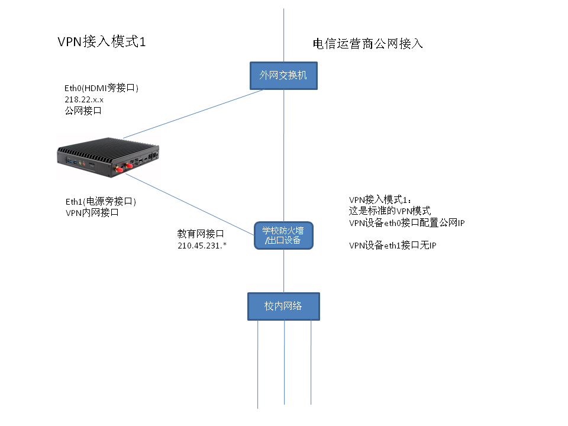
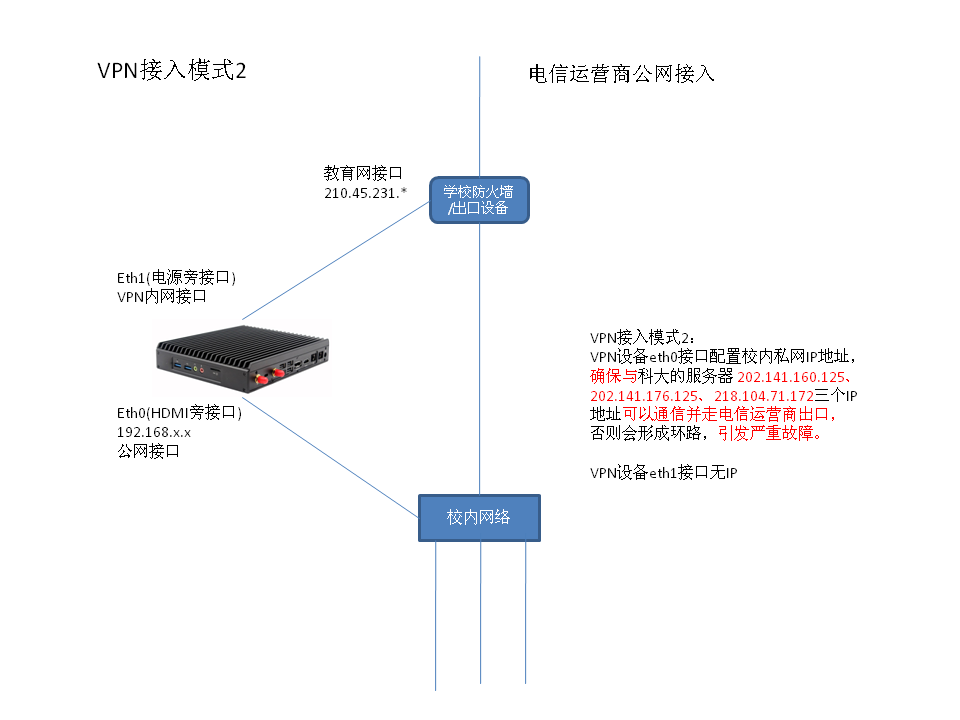

# 安徽省教育和科研计算机网专用VPN

## 一、用途

安徽省教育和科研网部分高校使用公网（电信/联通/移动）线路，建立VPN隧道，使用教育网出口。

## 二、连接方式

学校侧VPN设备有两种连接方式，按照学校的情况选择即可。

### 2.1 连接方式1

标准的VPN连接方式，如上图所示。VPN设备有2个接口:  
- eth0连接公网出口，设置公网IP和网关。
- eth1是VPN线路，连接至学校出口设备。

优点：  
- 逻辑清晰
- VPN设备进出流量不需要NAT

缺点：
- 需要在公网入口增加交换机，需要占用公网IP

### 2.2 连接方式2

也可以工作的VPN连接方式，如上图所示。VPN设备有2个接口:  
- eth0连接校内交换机，设置校内的IP和网关，只要该IP能与科大的VPN设备202.141.160.125/202.141.176.125/218.104.71.172通信即可。

- eth1是VPN线路，连接至学校出口设备。

优点：  
- 连接方便，不需要占用公网IP

缺点：
- 需要特别注意： VPN设备发送给科大VPN设备的数据包，只能通过公网路由NAT出去，不能发回教育网，否则产生环路，导致出口故障。

## 三、开通调试步骤

### 3.1 与科大联系，获取VPN设备

VPN设备由科大免费提供，每个有一个编号，不同的学校编号不同。

### 3.2 连接eth0网线

参考上述"二、连接方式"说明，根据学校情况，选择一种方式，将eth0（靠近HDMI的接口）连接至网络。

### 3.3 加电

请连接USB键盘、显示器（可以用HDMI或Display Port接口），连接电源线，自动开机。

### 3.4 设置

看到Login: 登录提示时，输入用户名 root，输入密码（密码贴在机器前面板），登录。

输入`vpnsetup`可以进入一个简单的设置页面，设置IP地址、掩码、网关，选择主要出口（电信/联通/移动），备用出口（电信/联通/移动），应用即可。

### 3.5 调试

设置完成后，返回Linux root登录界面。

只要能 `ping 202.141.160.125`，一般来说就可以工作了。如果碰到问题，可以使用`ip addr`，`ip route`，`ping`，`traceroute`，`tcpdump`等命令查找原因。

#### 3.6 开通

与科大联系，确认VPN线路已经工作，把eth1接口连接至学校防火墙，根据科大提供的IP地址，进行相关设置。

